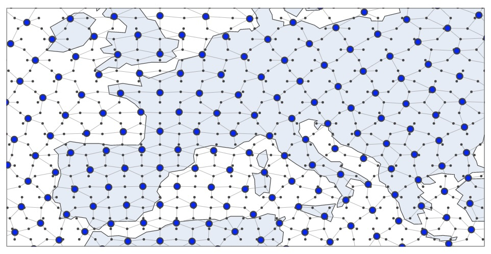
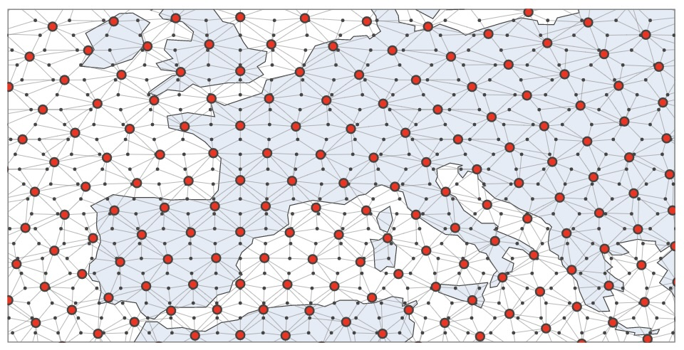
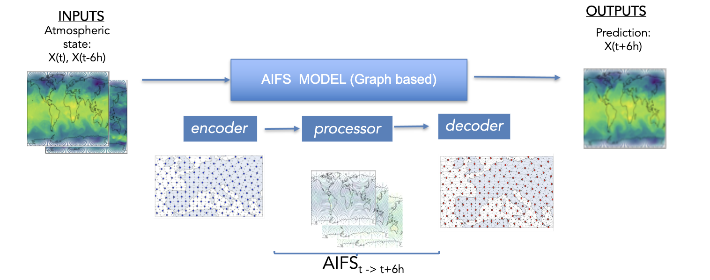
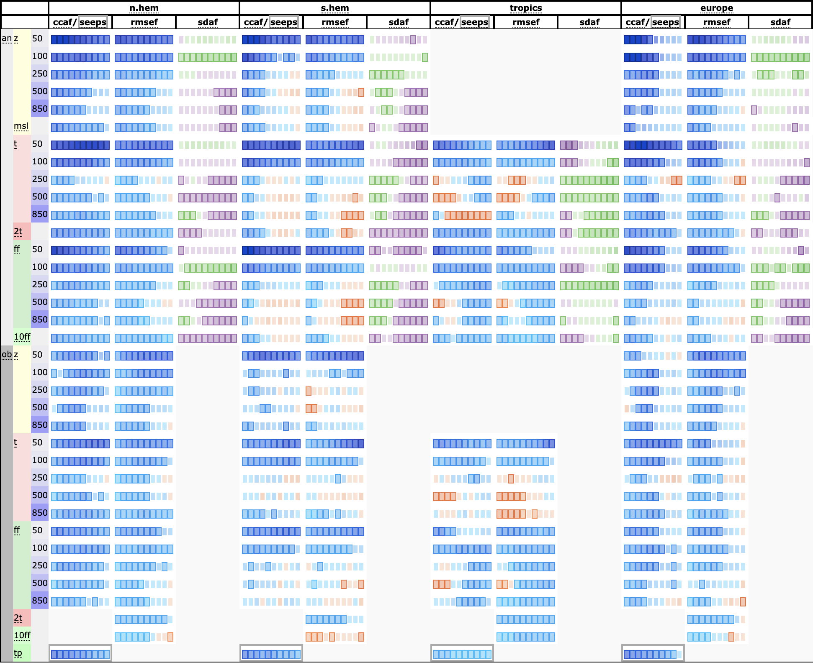
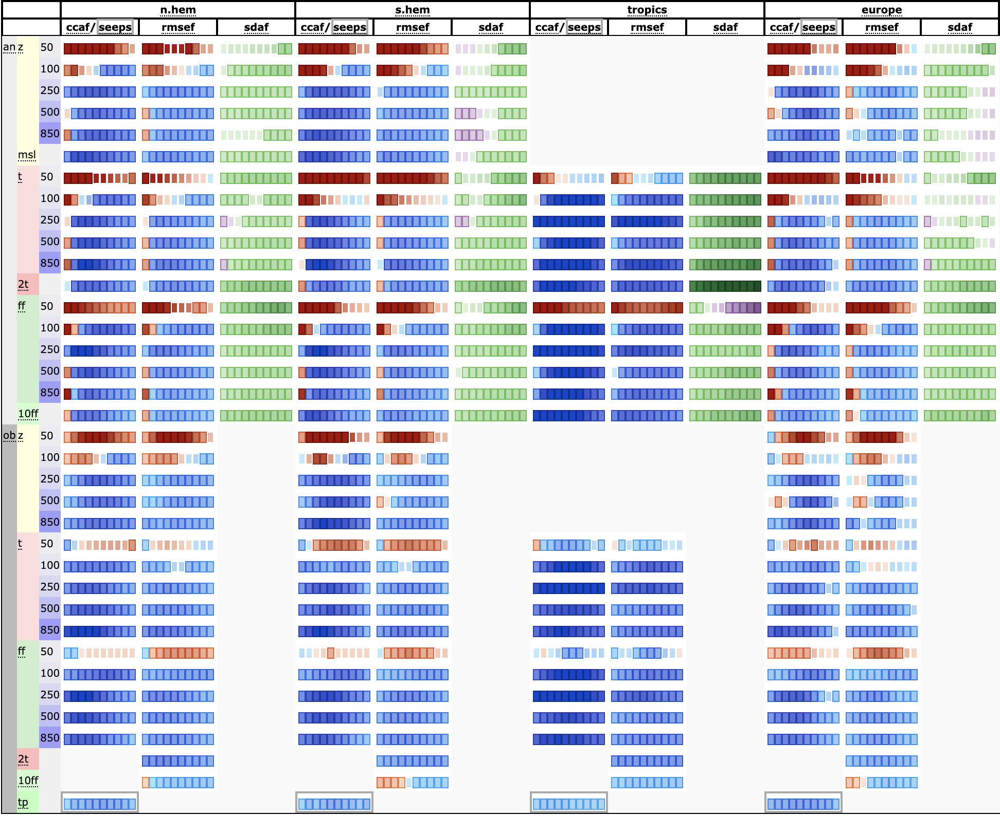

# AIFS Single - v1.0

<!-- Provide a quick summary of what the model is/does. -->

Here, we introduce the **Artificial Intelligence Forecasting System (AIFS)**, a data driven forecast
model developed by the European Centre for Medium-Range Weather Forecasts (ECMWF). 

The release of AIFS Single v1.0 marks the first operationally supported AIFS model. Version 1
supersedes the existing experimental version, [0.2.1 AIFS-single](https://huggingface.co/ecmwf/aifs-single-0.2.1). 
The new version, 1.0, brings changes to the AIFS Single model, including among many others:

- Improved performance for upper-level atmospheric variables (AIFS Single still uses 13 pressure-levels, so this improvement mainly refers to 50 and 100 hPa)
- Improved skill for total precipitation.
- Additional output variables, including 100 meter winds, snow-fall, surface solar-radiation and land variables such as soil-moisture and soil-temperature.

<div style="display: flex; justify-content: center;">
  
</div>

AIFS produces highly skilled forecasts for upper-air variables, surface weather parameters and
tropical cyclone tracks. AIFS Single is run four times daily alongside ECMWF’s physics-based NWP model and forecasts
are available to the public under ECMWF’s open data policy (https://www.ecmwf.int/en/forecasts/datasets/open-data). 
Note that due to the non-determinism of GPUs, users will be unable to exactly reproduce an official AIFS forecast 
when running AIFS Single themselves.

For more details please refer to https://confluence.ecmwf.int/display/FCST/Implementation+of+AIFS+Single+v1

## Data Details

### Data parameters

#### New parameters

More detailed information about the new parameters introduced with AIFS Single v1.0 is provided in the table below.

| Short Name | Name | Units | Component Type | Lev.Type |
|:----------:|:----:|:-----:|:--------------:|:--------:|
| ssrd  | Surface short-wave (solar) radiation downwards | \\(J m^{-2}\\) | AIFS | sfc |
| strd  | Surface long-wave (thermal) radiation downwards | \\(J m^{-2}\\) | AIFS | sfc |
| lcc   | Low cloud cover | \\((0 - 1)\\) | AIFS | sfc |
| mcc   | Medium cloud cover | \\((0 - 1)\\) | AIFS | sfc |
| hcc   | High cloud cover | \\((0 - 1)\\) | AIFS | sfc |
| sf    | Snowfall water equivalent | \\(kg m^{-2}\\) | AIFS | sfc |
| tcc   | Total cloud cover | \\((0 - 1)\\) | AIFS | sfc |
| 100u  | 100 metre U wind component | \\(m s^{-1}\\) | AIFS | sfc |
| 100v  | 100 metre V wind component | \\(m s^{-1}\\) | AIFS | sfc |
| rowe  | Runoff water equivalent (surface plus subsurface) | \\(kg m^{-2}\\) | AIFS | sfc |
| vsw   | Volumetric soil moisture | \\(m^3 m^{-3}\\) | AIFS | sol |
| sot   | Soil temperature | \\(K\\) | AIFS | sol |


#### Changes to existing parameters 

There are no changes to existing parameters already introduced with AIFS Single v0.2.1.

**Note** 
Regarding precipitation units, it's worth noting that AIFS model was trained on \\(m^{3}/m^{2}\\) and will therefore produce precip in that units.
If one wants to retrieve precipitation from Open data, the units will be \\(mm\\).

#### Discontinued parameters

No parameters have been discontinued with regards to the previous version of AIFS Single v0.2.1.


## Model Details

### Model Description

<!-- Provide a longer summary of what this model is. -->

AIFS is based on a graph neural network (GNN) encoder and decoder, and a sliding window transformer processor, 
and is trained on ECMWF’s ERA5 re-analysis and ECMWF’s operational numerical weather prediction (NWP) analyses. 

<div style="display: flex; justify-content: center;">
  
  
</div>

It has a flexible and modular design and supports several levels of parallelism to enable training on
high resolution input data. AIFS forecast skill is assessed by comparing its forecasts to NWP analyses
and direct observational data. 

- **Developed by:** ECMWF
- **Model type:** Encoder-processor-decoder model
- **License:** These model weights are published under a Creative Commons Attribution 4.0 International (CC BY 4.0).
To view a copy of this licence, visit https://creativecommons.org/licenses/by/4.0/. 
The notebooks and other script files are published under an Apache 2.0 licence, to view a copy of this license, visit https://www.apache.org/licenses/LICENSE-2.0.txt.

### Model resolution

There are no changes in resolution compared to previous version AIFS Single v0.2.1.

| | Component | Horizontal Resolution [kms] | Vertical Resolution [levels] |
|---|:---:|:---:|:---:|
| Atmosphere | AIFS-single v1.0 | ~ 31 |  13 |


### Model Sources

<!-- Provide the basic links for the model. -->

- **Repository:** [Anemoi](https://anemoi.readthedocs.io/en/latest/index.html) is an open-source framework for
  creating machine learning (ML) weather forecasting systems, which ECMWF and a range of national meteorological 
  services across Europe have co-developed.
- **Paper:** https://arxiv.org/pdf/2406.01465

## How to Get Started with the Model

To generate a new forecast using AIFS, you can use [anemoi-inference](https://github.com/ecmwf/anemoi-inference). In the [following notebook](run_AIFS_v1.ipynb), a 
step-by-step workflow is specified to run the AIFS using the HuggingFace model:

1. **Install Required Packages and Imports**
2. **Retrieve Initial Conditions from ECMWF Open Data**
  - Select a date
  - Get the data from the [ECMWF Open Data API](https://www.ecmwf.int/en/forecasts/datasets/open-data)
  - Get input fields
  - Add the single levels fields and pressure levels fields
  - Convert geopotential height into geopotential
  - Create the initial state
3. **Load the Model and Run the Forecast** 
  - Download the Model's Checkpoint from Hugging Face
  - Create a runner
  - Run the forecast using anemoi-inference
4. **Inspect the generated forecast**
  - Plot a field


🚨  **Note** we train AIFS using `flash_attention` (https://github.com/Dao-AILab/flash-attention).
The use of 'Flash Attention' package also imposes certain requirements in terms of software and hardware. Those can be found under #Installation and Features in https://github.com/Dao-AILab/flash-attention

🚨 **Note** the `aifs_single_v1.0.ckpt` checkpoint just contains the model’s weights. 
That file does not contain any information about the optimizer states, lr-scheduler states, etc.

## How to train AIFS Single v1.0

To train this model you can use the configuration files included in this repository and the following Anemoi packages:

```
anemoi-training==0.3.1
anemoi-models==0.4.0
anemoi-graphs==0.4.4
```
and run the pretraining stage as follows,

```
export DATASETS_PATH=???????
export OUTPUT_PATH=???????
anemoi-training train --config-name=config_pretraining.yaml
```

Now, you can fine-tune your model for rollout using the `run_id` of your previous run,
Note - this run_id refers to the run_id and you can find it looking at the checkpoint folder path.
For more details, please refer to https://anemoi.readthedocs.io/projects/training/en/latest/user-guide/training.html#restarting-a-training-run

```
export PRETRAINING_RUN_ID=???????
anemoi-training train --config-name=config_finetuning.yaml
```


## Training Details

### Training Data

<!-- This should link to a Dataset Card, perhaps with a short stub of information on what the training data is all about as well as documentation related to data pre-processing or additional filtering. -->

AIFS is trained to produce 6-hour forecasts. It receives as input a representation of the atmospheric states
at \\(t_{−6h}\\), \\(t_{0}\\), and then forecasts the state at time \\(t_{+6h}\\). 

<div style="display: flex; justify-content: center;">
  
</div>

The full list of input and output fields is shown below:

| Field                                                                                                                                                       | Level type                                                                   | Input/Output |
|-------------------------------------------------------------------------------------------------------------------------------------------------------------|------------------------------------------------------------------------------|--------------|
| Geopotential, horizontal and vertical wind components, specific humidity, temperature                                                                       | Pressure level: 50,100, 150, 200, 250,300, 400, 500, 600,700, 850, 925, 1000 | Both         |
| Surface pressure, mean sea-level pressure, skin temperature, 2 m temperature, 2 m dewpoint temperature, 10 m horizontal wind components, total column water | Surface                                                                      | Both         |
| Soil moisture and soil temperature (layers 1 & 2) | Surface | Both |
| 100m horizontal wind components, solar radiation (Surface short-wave (solar) radiation downwards and Surface long-wave (thermal) radiation downwards), cloud variables (tcc, hcc, mcc, lcc), runoff and snow fall  | Surface | Output | 
| Total precipitation, convective precipitation                                                                                                               | Surface                                                                      | Output       |
| Land-sea mask, orography, standard deviation of sub-grid orography, slope of sub-scale orography, insolation, latitude/longitude, time of day/day of year   | Surface                                                                      | Input        |

Input and output states are normalised to unit variance and zero mean for each level. Some of
the forcing variables, like orography, are min-max normalised.

### Training Procedure

Based on the different experiments we have made - the final training recipe for AIFS Single v1.0 has deviated slightly
from the one used for AIFS Single v0.2.1 since we found that we could get a well trained model by skipping the ERA5
rollout and directly doing the rollout on the operational-analysis (extended) dataset. When we say 'extended' we refer 
to the fact that for AIFS Single v0.2.1 we used just operational-analysis data from 2019 to 2021, while in this new 
release we have done the fine-tunning from 2016 to 2022. 

The other important change in the fine-tuning stage is that for AIFS Single v0.2.1 after the 6hr model training the
optimiser was not restarted (ie. rollout was done with the minimal lr of \\(3 × 10^{-7}\\)). For this release we have seen
that restarting the optimiser for the rollout improves the model's performance. For the operational-fine tuning rollout
stage, the learning rate cycle is restarted, gradually decreasing to the minimum value at the end of rollout.

<!-- This relates heavily to the Technical Specifications. Content here should link to that section when it is relevant to the training procedure. -->

- **Pre-training**: It was performed on ERA5 for the years 1979 to 2022 with a cosine learning rate (LR) schedule and a
total of 260,000 steps. The LR is increased from 0 to \\(10^{-4}\\) during the first 1000 steps, then it is annealed to a
minimum of \\(3 × 10^{-7}\\). The local learning rate used for this stage is \\(3.125 × 10^{-5}\\).
- **Fine-tuning**: The pre-training is then followed by rollout on operational real-time IFS NWP analyses for the years
2016 to 2022, this time with a local learning rate of \\(8 × 10^{−7}\\), which is decreased to \\(3 × 10^{−7}\\). Rollout steps
increase per epoch. In this second stage the warm up period of the optimiser is 100 steps to account for shorter length
of this stage. Optimizer step are equal to 7900 ( 12 epoch with ~630 steps per epoch).

As in the previous version of aifs-single for fine-tuning and initialisation of the model during inference, IFS fields
are interpolated from their native O1280 resolution (approximately \\(0.1°\\)) down to N320 (approximately \\(0.25°\\)). 

#### Training Hyperparameters

- **Optimizer:** We use *AdamW* (Loshchilov and Hutter [2019]) with the \\(β\\)-coefficients set to 0.9 and 0.95.

- **Loss function:** The loss function is an area-weighted mean squared error (MSE) between the target atmospheric state
and prediction.

- **Loss scaling:** A loss scaling is applied for each output variable. The scaling was chosen empirically such that
all prognostic variables have roughly equal contributions to the loss, with the exception of the vertical velocities,
for which the weight was reduced. The loss weights also decrease linearly with height, which means that levels in 
the upper atmosphere (e.g., 50 hPa) contribute relatively little to the total loss value.

#### Speeds, Sizes, Times

<!-- This section provides information about throughput, start/end time, checkpoint size if relevant, etc. -->

Data parallelism is used for training, with a batch size of 16. One model instance is split across four 40GB A100
GPUs within one node. Training is done using mixed precision (Micikevicius et al. [2018]), and the entire process
takes about one week, with 64 GPUs in total. The checkpoint size is 1.19 GB and as mentioned above, it does not include the optimizer 
state.

## Evaluation

<!-- This section describes the evaluation protocols and provides the results. -->

AIFS is evaluated against ECMWF IFS (Integrated Forecast System) for 2022. The results of such evaluation are summarized in 
the scorecard below that compares different forecast skill measures across a range of
variables. For verification, each system is compared against the operational ECMWF analysis from which the forecasts
are initialised. In addition, the forecasts are compared against radiosonde observations of geopotential, temperature
and windspeed, and SYNOP observations of 2 m temperature, 10 m wind and 24 h total precipitation. The definition
of the metrics, such as ACC (ccaf), RMSE (rmsef) and forecast activity (standard deviation of forecast anomaly,
sdaf) can be found in e.g Ben Bouallegue et al. ` [2024].

### AIFS Single v1.0 vs AIFS Single v0.2.1 (2023)

<div style="display: flex; justify-content: center;">
  
</div>

### AIFS Single v1.0 vs IFS (2024)

<div style="display: flex; justify-content: center;">
  
</div>


Forecasts are initialised on 00 and 12 UTC. The scorecard show relative score changes as function of lead time (day 1 to 10) for northern extra-tropics (n.hem),
southern extra-tropics (s.hem), tropics and Europe. Blue colours mark score improvements and red colours score
degradations. Purple colours indicate an increased in standard deviation of forecast anomaly, while green colours
indicate a reduction. Framed rectangles indicate 95% significance level. Variables are geopotential (z), temperature
(t), wind speed (ff), mean sea level pressure (msl), 2 m temperature (2t), 10 m wind speed (10ff) and 24 hr total
precipitation (tp). Numbers behind variable abbreviations indicate variables on pressure levels (e.g., 500 hPa), and
suffix indicates verification against IFS NWP analyses (an) or radiosonde and SYNOP observations (ob). Scores
shown are anomaly correlation (ccaf), SEEPS (seeps, for precipitation), RMSE (rmsef) and standard deviation of
forecast anomaly (sdaf, see text for more explanation).


# Known limitations
- This version of AIFS shares certain limitations with some of the other data-driven weather forecast models that are trained with a weighted MSE loss, such as blurring of the forecast fields at longer lead times.
- AIFS exhibits reduced forecast skill in the stratosphere, partially due to a low model top.
- AIFS currently provides reduced intensity of some high-impact systems such as tropical cyclones.

Please refer to https://confluence.ecmwf.int/display/FCST/Known+AIFS+Forecasting+Issues for further details

## Technical Specifications

### Hardware

<!--  {{ hardware_requirements | default("[More Information Needed]", true)}} -->

We acknowledge PRACE for awarding us access to Leonardo, CINECA, Italy. In particular, this version of the AIFS has been trained 
on 64 A100 GPUs (40GB).

### Software

The model was developed and trained using the [AnemoI framework](https://anemoi-docs.readthedocs.io/en/latest/index.html).
AnemoI is a framework for developing machine learning weather forecasting models. It comprises of components or packages
for preparing training datasets, conducting ML model training and a registry for datasets and trained models. AnemoI
provides tools for operational inference, including interfacing to verification software. As a framework it seeks to
handle many of the complexities that meteorological organisations will share, allowing them to easily train models from
existing recipes but with their own data.

## Citation

<!-- If there is a paper or blog post introducing the model, the APA and Bibtex information for that should go in this section. -->

If you use this model in your work, please cite it as follows:

**BibTeX:**

```
@article{lang2024aifs,
  title={AIFS-ECMWF's data-driven forecasting system},
  author={Lang, Simon and Alexe, Mihai and Chantry, Matthew and Dramsch, Jesper and Pinault, Florian and Raoult, Baudouin and Clare, Mariana CA and Lessig, Christian and Maier-Gerber, Michael and Magnusson, Linus and others},
  journal={arXiv preprint arXiv:2406.01465},
  year={2024}
}
```

**APA:**

```
Lang, S., Alexe, M., Chantry, M., Dramsch, J., Pinault, F., Raoult, B., ... & Rabier, F. (2024). AIFS-ECMWF's data-driven forecasting system. arXiv preprint arXiv:2406.01465.
```


## More Information

[Find the paper here](https://arxiv.org/abs/2406.01465)